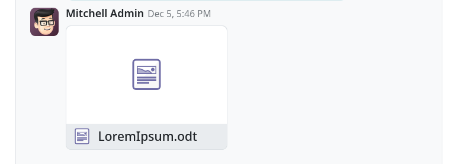
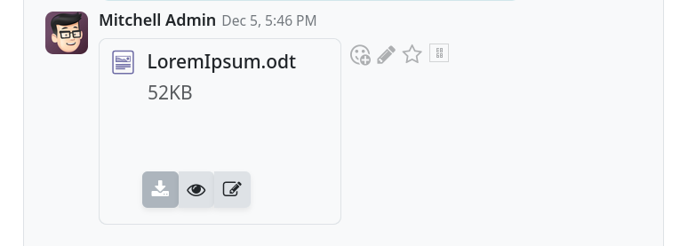
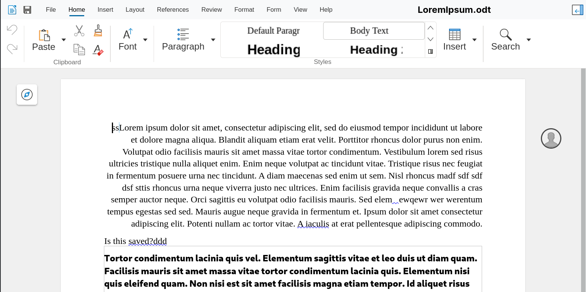

# Collabora Online Odoo

This plugin allow the integration of Collabora Online with Odoo.

What you need is:

- Odoo 19
- Collabora Online. The latter can be run on any server that is
  accessible and that can access the Odoo server.

Collabora Online is an online office suite based on LibreOffice. It is
open source, and is meant to be hosted on premise. This Odoo module is
designed to use Collabora Online to open and edit office files stored
in Odoo. It will use the user credentials from your Odoo system to
determine access to the documents for collaboration.

For more information see https://collaboraonline.com/

SECURITY NOTE: The plugin hasn't gone through a security review
yet.

The plugin itself is inside the `collabora_odoo` directory to fit
within the requirements of the Odoo store.

## Versioning

Understanding the versioning is important. The first digit in the
version number (19.0.x.x.x) are the version of Odoo the module is
compatible with. In this case it's Odoo 19.

## Configuration

Once the plugin is installed you can set the configuration using the
Odoo settings pages.

- _Collabora Online server URL_: the URL of the collabora online
  server. Note that you have to take into considerartion
  containers. If you run Odoo in one container and Collabora Online in
  another, you can not use `localhost`.
- _WOPI host base URL_: how the Collabora Online server can reach the
  Odoo server. Usually it is the public URL of this Odoo server.
- _JWT Private Key_: the secret to create the JWT private key.

You can create a secret using the following shell command:

```shell
head -c 64 /dev/urandom | base64 -w 0
```

- _Access Token Expiration_: In seconds, the expiration of the token
  to access the document. Defaults to 86400 seconds (24 hours).

## Screenshots

A document attached to a discussion. This can be any attachment anywhere.



Hover with the mouse you can see the action buttons.



The document being edited.



## Reporting issues

Please use the GitHub bug tracker to report issues:

https://github.com/CollaboraOnline/collabora_odoo/issues

## License

This plugin is published under the MPL-2.0 license.

## Maintenance

This plugin is maintained by Collabora Productivity.
